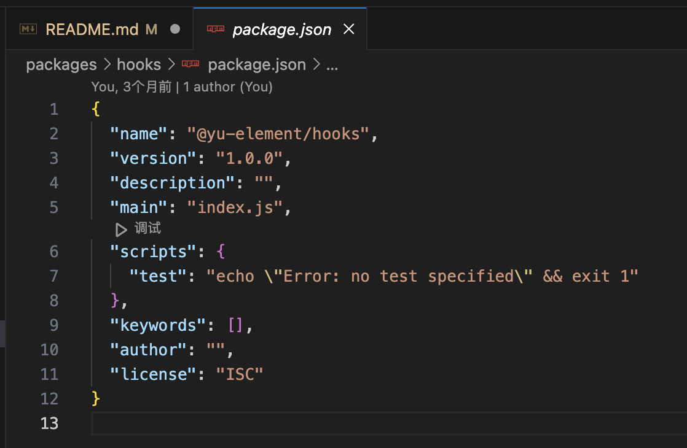
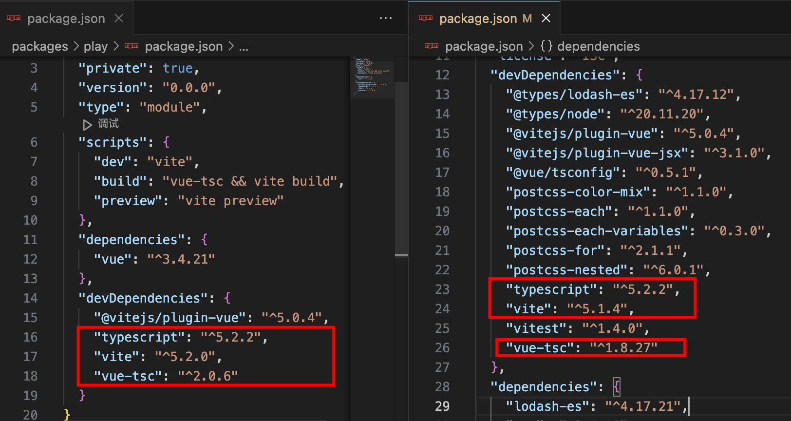
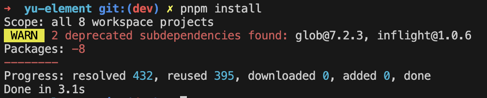
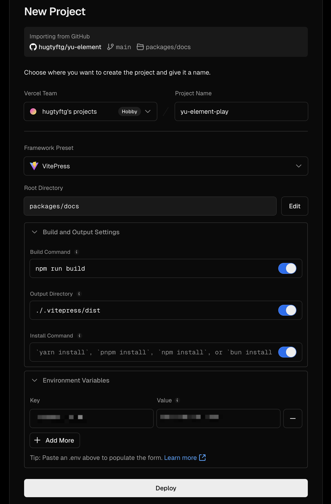
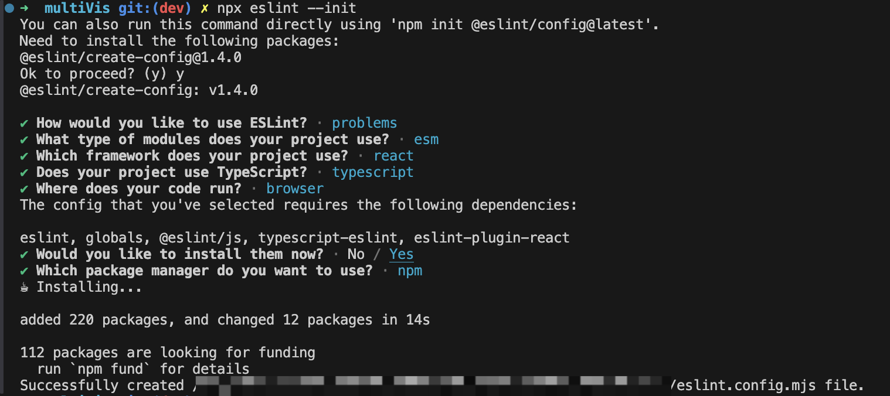
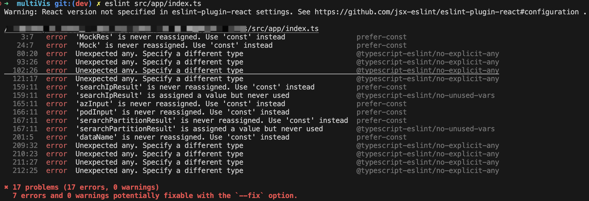
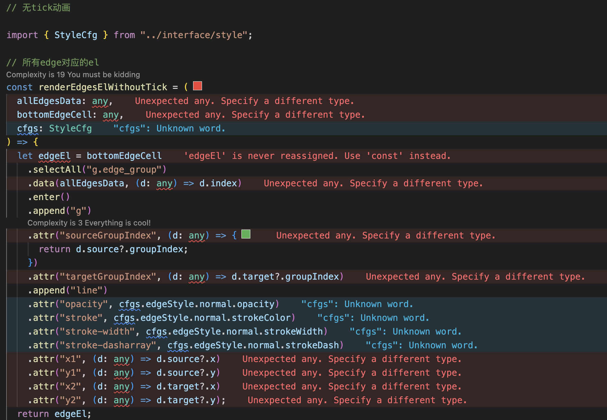
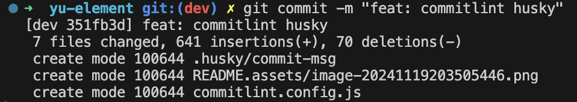
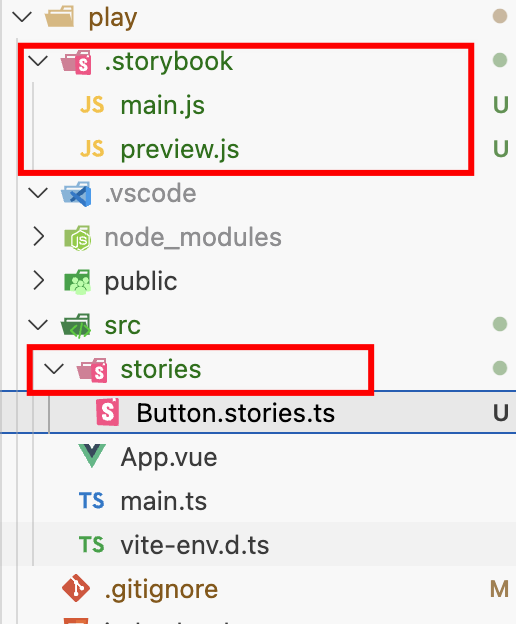
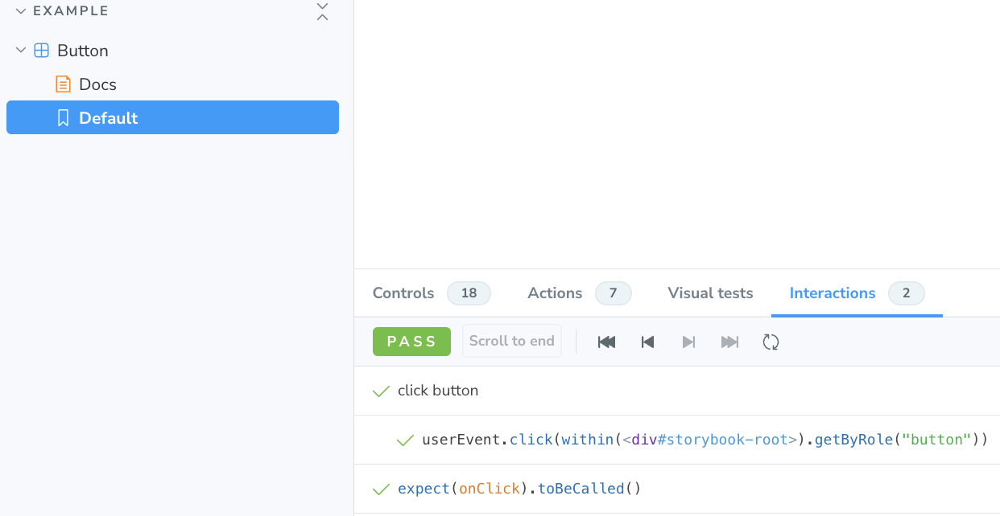

# 项目亮点

- Vite + Vitest + Vitepress 工具链

- monorepo 分包管理

- github actions 实现 CI/CD 自动化部署

# 目录结构简介

- components 开发的组件

- core npm 包入口

- docs 项目文档

- hooks 自定义钩子（利用 vue 的 composition api 封装实现）

- play 组件使用、体验的示范工程

- theme 样式

- utils 工具函数

注意：本 monorepo 工程下的所有包，只有 core 和工程同名，其他包需要加上前缀`@yu-element/`以防和其他开源库重名

# 项目搭建

## [项目初始化](https://ericwxy.github.io/eric-wiki/my-projects/eric-ui/start.html#项目初始化)

```
mkdir yu-element

cd yu-element

git init

code .
```

创建 pnpm-workspace.yaml 文件配置 monorepo

```
mkdir packages

echo -e 'packages:\n  - "packages/*"' > pnpm-workspace.yaml

pnpm init
```

创建 `.gitignore`

```
# Logs
logs
*.log
npm-debug.log*
yarn-debug.log*
yarn-error.log*
pnpm-debug.log*
lerna-debug.log*

node_modules
coverage
dist
dist-ssr
*.local

/cyperss/videos/
/cypress/srceenshots/

.vitepress/dist
.vitepress/cache

# Editor directories and files
.vscode/*
!.vscode/extensions.json
.idea
.DS_Store
*.suo
*.ntvs*
*.njsproj
*.sln
*.sw?
```

为了目录扁平，只创建 packages 这么一个 pnpm 工作区，下面大概介绍一下这个项目计划的分包结构

```
- components # 组件目录
- core # npm 包入口
- docs # 文档目录
- hooks # 组合式API hooks 目录
- play # 组件开发实验室
- theme # 主题目录
- utils # 工具函数目录
```

在 packages 目录下创建 `init.shell`，执行脚本自动化创建这些子包的目录

```
cd packages
```

```
# init.shell
for i in components core docs hooks theme utils; do
  mkdir $i
  cd $i
  pnpm init
  cd ..
done
```

执行后删除 `init.shell`

手动用 vite 来创建一个 vue 开发项目作为 playground

```
pnpm create vite play --template vue-ts
```

只有 core 目录下的子包的 name 与项目同名，其他各个子包需要手动到目录中修改 `package.json` 中的 `name`。为了避免和第三方开源库重名 ，使用`@项目名/子目录`方式



## [安装基础依赖](https://ericwxy.github.io/eric-wiki/my-projects/eric-ui/start.html#安装基础依赖)

```
pnpm add -Dw typescript@^5.2.2 vite@^5.1.4 vitest@^1.4.0 vue-tsc@^1.8.27 postcss-color-mix@^1.1.0 postcss-each@^1.1.0 postcss-each-variables@^0.3.0 postcss-for@^2.1.1 postcss-nested@^6.0.1 @types/node@^20.11.20 @types/lodash-es@^4.17.12 @vitejs/plugin-vue@^5.0.4 @vitejs/plugin-vue-jsx@^3.1.0 @vue/tsconfig@^0.5.1

pnpm add -w lodash-es@^4.17.21 vue@^3.4.19
```

在 根目录 package.json 中添加 monorepo 所需的如下内容

```
  "dependencies": {
    "yu-element": "workspace:*",
    "@yu-element/hooks": "workspace:*",
    "@yu-element/theme": "workspace:*",
    "@yu-element/utils": "workspace:*"
  }
```

> 接下来，添加 分包 中的依赖

- components

  ```
  pnpm add -D @vue/test-utils@^2.4.5 @vitest/coverage-v8@^1.4.0 jsdom@^24.0.0 --filter @yu-element/components
  pnpm add @popperjs/core@^2.11.8 async-validator@^4.2.5 --filter @yu-element/components
  ```

- core

  在 core/package.json 中添加如下内容，说明 core 子包依赖内部子包@yu-element/components

  ```
  {
    "dependencies": {
      "@yu-element/components": "workspace:*"
    }
  }
  ```

- docs

  ```
  pnpm add -D vitepress@1.0.0-rc.44 --filter @yu-element/docs
  ```

- play

  将 play/package.json 中冗余部分删除（根目录中已经有了）

  

删除 tsconfig.js 和 tsconfig.node.js 文件，后续在根目录下会新建全局 tsconfig.json 和 tsconfig.node.json 文件

## 配置

在根目录创建一些必要额配置文件

### postcss

postcss.config.cjs

```
/* eslint-env node */
module.exports = {
  plugins: [
    require("postcss-nested"),
    require("postcss-each-variables"),
    require("postcss-each")({
      plugins: {
        beforeEach: [require("postcss-for"), require("postcss-color-mix")],
      },
    }),
  ],
};
```

### 全局 ts 规则

tsconfig.json

```
{
  "extends": "@vue/tsconfig/tsconfig.dom.json",
  "compilerOptions": {
    "target": "ES2020",
    "useDefineForClassFields": true,
    "module": "ESNext",
    "lib": ["ES2020", "DOM", "DOM.Iterable"],
    "skipLibCheck": true,

    /* Bundler mode */
    "moduleResolution": "bundler",
    "allowImportingTsExtensions": true,
    "resolveJsonModule": true,
    "isolatedModules": true,
    "noEmit": true,
    "jsx": "preserve",
    "jsxImportSource": "vue",

    /* Linting */
    "strict": true,
    "noUnusedLocals": true,
    "noUnusedParameters": true,
    "noFallthroughCasesInSwitch": true
  },
  "include": ["packages/**/*.ts", "packages/**/*.tsx", "packages/**/*.vue"]
}
```

tsconfig.node.json

```
{
  "extends": "@tsconfig/node18/tsconfig.json",
  "include": ["packages/**/**.config.ts"],
  "compilerOptions": {
    "composite": true,
    "module": "ESNext",
    "moduleResolution": "Bundler",
    "types": ["node"]
  }
}
```

## 创建 monorepo 模式下的依赖路径

**根目录下 pnpm install 会建立整个项目和子包以及子包内的连接关系**

**Scope: all 8 workspace projects**



## [创建各个分包入口](https://ericwxy.github.io/eric-wiki/my-projects/eric-ui/start.html#创建各个分包-入口)

### utils

组件库需要作为插件被挂载到全局

一个插件可以是一个install方法，也可以是一个有install方法的对象

install函数有两个参数，第一个参数是应用实例，第二个参数是传递给app.use的额外选项

```
app.use(myPlugin, {
  /* 可选的选项 */
})
type InstallFunction = (app: App, options?: any) => any
```

创建`install.ts`，包含

- withInstall方法用于给组件添加install方法将组件插件化
- makeInstall方法用于创建注册插件化组件list的install函数

```
import type { App, Plugin } from 'vue';
import { each } from 'lodash-es';

type SFCWithInstall<T> = T & Plugin;

/**
 * 注册所有插件化的组件
 * 该插件是一个install函数
 * @param components 需要被注册的插件
 * @returns 注册函数
 */
export function install(components: Plugin[]) {
  return (app: App) => each(components, (c) => app.use(c));
}

/**
 * 给component添加install方法，使之成为plugin
 * 该插件是一个具有install方法的component对象
 * https://cn.vuejs.org/guide/reusability/plugins.html
 * @param component 作为插件的组件
 * @returns 插件化的组件
 */
export function withInstall<T>(component: T) {
  (component as SFCWithInstall<T>).install = (app: App) => {
    const name = (component as any).name;
    app.component(name, component as Plugin);
  };
  return component;
}
```

### components

创建 `index.ts` 以及第一个开胃菜 Button 组件的目录

我们先在 Button 目录创建一个最简陋的 vue sfc

```
<template>
  <button style="color: red; background-color: #fff;">test button</button>
</template>

<script setup>
  // 在 <script setup> 中声明组件选项
  // https://cn.vuejs.org/api/sfc-script-setup.html#defineoptions
  defineOptions({
    name: 'YuButton'
  })
</script>
```

并在 Button 目录中创建 入口 `index.ts` 导出我们的 Button 组件

> 注： 这里说明一下，我们这次的组件库项目每个组件的目录大致结构如下,简单统一规范一下
>
> ```
> - Xxx.test.tsx
> - Xxx.vue
> - types.ts
> - style.css
> - index.ts
> - * constants.ts
> ```

在 components/index.ts 中导出我们的 Button 组件

改 package.json 中 入口为 `index.ts`

> 如果无法识别.vue文件，需要在component内添加env.d.ts文件
>
> ```
> // env.d.ts
> declare module '*.vue' {
>   import { ComponentOptions } from 'vue';
>   const componentOptions: ComponentOptions;
>   export default componentOptions;
> }
> ```

### core

创建 `index.ts` 、`components.ts`

```
import { YuButton } from '../components';
import type { Plugin } from 'vue';

export default [YuButton] as Plugin[];

```

在 core/index.ts 中导出我们的 components

```
import { install } from '@yu-element/utils';
import components from './components';
// 全局导入样式
import '@yu-element/theme/index.css';

// 注册所有组件的函数
const installer = install(components);

export * from '@yu-element/components';
export default installer;
```

改 package.json 中 入口为 `index.ts`

### theme

theme 创建 `index.css` 、`reset.css` 在 theme/index.css 中导入 reset.css

```
/** reset.css */
body {
  font-family: var(--er-font-family);
  font-weight: 400;
  font-size: var(--er-font-size-base);
  line-height: calc(var(--er-font-size-base) * 1.2);
  color: var(--er-text-color-primary);
  -webkit-font-smoothing: antialiased;
  -moz-osx-font-smoothing: grayscale;
  -webkit-tap-highlight-color: transparent;
}

a {
  color: var(--er-color-primary);
  text-decoration: none;

  &:hover,
  &:focus {
    color: var(--er-color-primary-light-3);
  }

  &:active {
    color: var(--er-color-primary-dark-2);
  }
}

h1,
h2,
h3,
h4,
h5,
h6 {
  color: var(--er-text-color-regular);
  font-weight: inherit;

  &:first-child {
    margin-top: 0;
  }

  &:last-child {
    margin-bottom: 0;
  }
}

h1 {
  font-size: calc(var(--er-font-size-base) + 6px);
}

h2 {
  font-size: calc(var(--er-font-size-base) + 4px);
}

h3 {
  font-size: calc(var(--er-font-size-base) + 2px);
}

h4,
h5,
h6,
p {
  font-size: inherit;
}

p {
  line-height: 1.8;

  &:first-child {
    margin-top: 0;
  }

  &:last-child {
    margin-bottom: 0;
  }
}

sup,
sub {
  font-size: calc(var(--er-font-size-base) - 1px);
}

small {
  font-size: calc(var(--er-font-size-base) - 2px);
}

hr {
  margin-top: 20px;
  margin-bottom: 20px;
  border: 0;
  border-top: 1px solid var(--er-border-color-lighter);
}
```

```
/** index.css */
@import "./reset.css";
```

改 package.json 中 入口为 `index.css`

```
{
  "name": "@yu-element/theme",
  "version": "1.0.0",
  "description": "",
  "main": "index.css",
  "scripts": {
    "test": "echo \"Error: no test specified\" && exit 1"
  },
  "keywords": [],
  "author": "",
  "license": "ISC"
}
```

在 core/index.ts 中导入样式

## 在play中演练实时效果

### 添加脚本

在 根目录 `package.json` 中添加命令，-- filter用于指定分包

```
  "scripts": {
    "dev": "pnpm --filter @yu-element/play dev"
  },
```

### 启动工程

```
pnpm dev
```

## [创建 VitePress 文档](https://ericwxy.github.io/eric-wiki/my-projects/eric-ui/start.html#创建vitepress文档)

直接参考官方文档 https://vitepress.dev/zh/guide/getting-started

```
cd packages/docs
npx vitepress init
```

```
➜  docs git:(dev) ✗ npx vitepress init

┌  Welcome to VitePress!
│
◇  Where should VitePress initialize the config?
│  ./
│
◇  Site title:
│  Yu-Element
│
◇  Site description:
│  A ElementPlus-like component library!
│
◇  Theme:
│  Default Theme
│
◇  Use TypeScript for config and theme files?
│  Yes
│
◇  Add VitePress npm scripts to package.json?
│  Yes
│
└  Done! Now run npm run docs:dev and start writing.

```

修改package.json

```
  "scripts": {
    "test": "echo \"Error: no test specified\" && exit 1",
    "dev": "vitepress dev",
    "build": "vitepress build",
    "preview": "vitepress preview"
  },
```

根目录下添加npm script

```
  "scripts": {
    "dev": "pnpm --filter @yu-element/play dev",
    "docs:dev": "pnpm --filter @yu-element/docs dev",
    "docs:build": "pnpm --filter @yu-element/docs build",
    "docs:preview": "pnpm --filter @yu-element/docs preview"
  },
```

根目录下执行`pnpm docs:dev`，会5

## deploy on Vercel

傻瓜式操作，注意配置CI脚本和output路径



https://yu-element.vercel.app/

## 参考

https://ericwxy.github.io/eric-wiki/my-projects/eric-ui/start.html

# 工程化配置

## .nvmrc规范node版本

### 1. 前言

当开发多个项目时，每个项目运行环境要求的 node 版本不一样，那么我们就需要给每个项目指定 node 版本，也就是通过终端执行 nvm install 和 nvm use 命令去安装并切换版本。

但是每次都要在终端手动执行命令就很麻烦，特别是项目越来越多的时候，容易忘记切换版本或切换错版本，会导致项目启动不了或运行中有一些错误。

这就需要一个管理 node 版本的方法，自动切换 node 版本，这时 .nvmrc 就该上场了

### 2. .nvmrc 是什么

.nvmrc 的作用：便于切换 node 版本，保证多人开发环境的一致性

.nvmrc 是一个文件，文件内容非常简单，只有一个 nvm 可识别的 node 版本文本内容，比如: v12.18.2，这个文件应该放在项目根目录下，并且不应被 git 忽略

### 3. 创建 .nvmrc 文件

```
v18.20.5
```

### 4. 使用 .nvmrc 文件

在有 .nvmrc 文件的目录执行以下命令，会读取并尝试切换 .nvmrc 中的 node 版本

该命令会从当前目录向上遍历目录结构寻找 .nvmrc 文件，在带有 .nvmrc 的目录的任何子目录运行该命令都会起作用

```
nvm use xxx
```

如果 .nvmrc 中的 node 版本已安装，当前终端窗口的 node 将自动切换为该版本

### 5.查看所有node版本

```
➜  yu-element git:(dev) ✗ nvm list
       v16.20.1
       v18.20.5
->       system
```

## commitlint规范commit message

```
// 安装commitlint
pnpm install @commitlint/config-conventional @commitlint/cli -Dw
```

根目录增加其配置文件`commitlint.config.js`

```
module.exports = {
  extends: ['@commitlint/config-conventional'],
};
```

一般情况下，默认的就够用了。

当然，如果需要自定义限制这些规则，不启用默认的规则，可以把配置写的更详细

```
module.exports = {
  extends: [
    "@commitlint/config-conventional"
  ],
  rules: {
    'type-enum': [2, 'always', [
      'upd', 'feat', 'fix', 'refactor', 'docs', 'chore', 'style', 'revert'
     ]],// type类型
    'type-case': [0],
    'type-empty': [0],
    'scope-empty': [0],
    'scope-case': [0],
    'subject-full-stop': [0, 'never'],
    'subject-case': [0, 'never'],
    'header-max-length': [0, 'always', 72]
  }
};
```

rule配置说明:：rule由name和配置数组组成，如：'name:[0, 'always', 72]'，

数组中第一位为level，可选0,1,2，0为disable，1为warning，2为error，

第二位为应用与否，可选always|never，

第三位该rule的值。

具体配置项参考其[官方文档](https://commitlint.js.org/#/reference-configuration)

## eslint+prettier统一代码风格

eslint是一个开源项目，static code analysis tool，它可以静态分析js或JSX代码，按照内置规则或者自定义规则发现代码中的问题、提供自动修复方案，web端和服务器端都可以使用，任何框架下也都可以使用，甚至没有框架也可以使用

### ESLint

#### 1.安装

```
# 全局安装eslint包（也可以在项目内安装，参考官网）
npm i -g eslint
```

#### 2.初始化

```
# 在当前项目目录下执行eslint初始化
npx eslint --init
```



#### 3.手动校验指定文件

```
# 校验指定文件的格式，但是仅仅是列出来而已，并没有编辑区的视觉提示
eslint 文件路径
```



#### 4.插件自动校验与显示

ESLint插件——无需手动执行命令，编辑区就能看到波浪线提示



#### 5.进阶——package.json中配置整体lint校验

```
  "scripts": {
    "dev": "vite",
    "lint": "eslint ."
  },
```

#### 6.进阶——禁用某些rule

覆盖掉默认设置即可，对于pluginVue.configs也是类似的思路

```
import globals from 'globals';
import pluginJs from '@eslint/js';
import tseslint from 'typescript-eslint';
import pluginVue from 'eslint-plugin-vue';

const offRules = {
  '@typescript-eslint/no-explicit-any': 'off',
  '@typescript-eslint/no-require-imports': 'off',
};

/** @type {import('eslint').Linter.Config[]} */
export default [
  { files: ['**/*.{js,mjs,cjs,ts,vue}'] },
  { languageOptions: { globals: { ...globals.browser, ...globals.node } } },
  pluginJs.configs.recommended,
  ...tseslint.configs.recommended.map((rulesObj) => {
    if (rulesObj.name === 'typescript-eslint/recommended') {
      return {
        name: 'typescript-eslint/recommended',
        rules: {
          ...rulesObj.rules,
          ...offRules,
        },
      };
    }
    return rulesObj;
  }),
  ...pluginVue.configs['flat/essential'],
  {
    files: ['**/*.vue'],
    languageOptions: { parserOptions: { parser: tseslint.parser } },
  },
];
```

### prettier

#### 1.安装

```
pnpm i prettier -Dw
```

#### 2.手动添加.prettierrc配置文件

#### 3.手动格式化指定文件

```
npx prettier --write 文件路径
```

#### 4.自动可视化插件 vscode prettier

### 注意

通过npm下载并配置到项目内的ESLint，在ide/编辑器不安装ESLint插件时，也能正常工作

换言之，不推荐只安装ESLint插件而不给项目整体配置ESLint，因为有的coworker可能不想安装！

ESLint局限性，只能处理js文件，不能处理css、JSON等文件，prettier可以处理多种文件

**ESLint和Prettier的配置注意不要冲突**

## husky自动化检查

husky是一个git hook的管理工具，实现了大部分的git hook。一般情况下，**commitlint会用在git的hook回调中**，如果不想自己写[githook](https://git-scm.com/docs/githooks)s，那么最简单的就是和 husky一起使用。

```
// 在package.json中配置husky. hooks
{
  "husky": {
    "hooks": {
      "pre-commit": "echo 我要提交代码啦",
      "commit-msg": "commitlint -E HUSKY_GIT_PARAMS",
      "pre-push": "echo 我要推送代码啦"
    }
  }
}
```

通过HUSKY_GIT_PARAMS传递参数，-E|--env用于指向相关的编辑文件。

husky的作用就是给commit的动作加上一个hook，当commit动作触发的时候，自动执行commitlint检查

### 1.生成.husky文件夹

```
pnpm i husky -Dw
```

### 2.在`.husky`文件夹下面创建commit-msg文件(不要任何的后缀)

```
npx --no -- commitlint --edit "${1}"
```

> 文件名就表示勾住git中的哪个hook（commit-msg）

除此之外，husky还可以增加其他的hook如pre-commit

```shell
npx husky add .husky/pre-commit "npm test"
```

> pre-commit，这个hook的效果是，在commit之前，跑一遍测试

### 3.完成，测试



# 样式

## 全局样式

reset.css覆盖浏览器默认样式

index.css定义全局通用变量

## 组件样式

绑定class，并利用字符串拼接出类名

style.css内引入类名

style scoped标签局部引入样式防止污染。样式穿透需要借助:deep()语法

# Button组件

每个组件的目录格式：

- index.vue：主要模版和逻辑
- index.ts：包装必备方法如install后再把插件暴露到外界
- types.ts：组件prpos、emit等类型
- style.css：样式
- Xxx.test.tsx：vitest测试文件

## 主要逻辑

1. props默认值覆盖
2. 注册emit，并根据props确定是否要throttle节流包装handler
3. 插槽
4. 通过define Expose向父组件暴露Button组件的dom
5. 根据props中的type、size等绑定class

# storybook

## 安装

在playground内安装storybook，会多出两个目录

```
pnpm dlx storybook@latest init
```



## 书写组件的Example

以Button组件为例，在src/stories下新建Button.stories.ts，书写：

- 沙盒容器
- 沙盒内容
- 配置页信息，如标题、组件、标签、参数类型
- 默认页信息

## 脚本命令

play目录中的storybook命令可以本地开启storybook

在根目录下通过pnpm --filter添加storybook script即可

```
  "scripts": {
    "dev": "pnpm --filter @yu-element/play dev",
    "docs:dev": "pnpm --filter @yu-element/docs dev",
    "docs:build": "pnpm --filter @yu-element/docs build",
    "docs:preview": "pnpm --filter @yu-element/docs preview",
    "lint": "eslint .",
    "test": "pnpm --filter @yu-element/components test",
    "storybook": "pnpm --filter @yu-element/play storybook"
  },
```

# Icon

## 安装并引入fontawesome

```
➜  yu-element git:(dev) ✗ pnpm i -Dw @fortawesome/fontawesome-svg-core @fortawesome/free-solid-svg-icons @fortawesome/vue-fontawesome
```

需要在core文件中引入应使用fontawesome才能生效

```
// 引入fontawesome
import { library } from '@fortawesome/fontawesome-svg-core';
import { fas } from '@fortawesome/free-solid-svg-icons';
library.add(fas);
```

## 主要逻辑

- 核心图标为fontawesome，外部通过i标签包裹
- inheritAttrs: false与v-bind="$attrs"

## 融合Button

### loading状态图标

```
    <!-- loading图标样式 -->
    <template v-if="props.loading">
      <slot name="loading">
        <YuIcon class="loading-icon" :icon="loadingIcon ?? 'spinner'" :style="iconStyle" size="1x" />
      </slot>
    </template>
```

### 非loading状态设置图标

```
    <!-- 不loading时的默认图标样式 -->
    <YuIcon v-if="props.icon && !props.loading" :icon="props.icon" :style="iconStyle" />
```

## storybook 测试用例

```js
  // 默认页的测试用例
  play: async ({ canvasElement, args, step }) => {
    // 进入页面：将 canvasElement 包装为一个测试工具对象 canvas
    const canvas = within(canvasElement);
    // 测试步骤：单次点击页面中第一个button按钮
    await step('click button', async () => {
      await userEvent.click(canvas.getByRole('button'));
    });
    // 期望结果：验证 args 对象中的 onClick 方法是否被调用
    expect(args.onClick).toBeCalled();
  },
```

默认页面的interactions tab自动执行了测试步骤



# loadsh工具函数

## omit

## throttle

### API

throttle(func, [wait=0], [options={}])

func (Function): 要节流的函数。

[wait=0] (number): 需要节流的毫秒数。

[options={}] (Object): 选项对象。

[options.leading=true] (boolean): 指定调用在节流开始前，默认true。

[options.trailing=true] (boolean): 指定调用在节流结束后，默认true。

### **Demo**

```sql
Throttle: _.throttle(function() {
  console.log("throttle");
}, 5000, {
  leading: true,
  trailing: false
})
```

testThrottle方法被绑定在一个按钮上，demo最终的效果是 ：

1、按钮点击后控制台立马打印了throttle——19:39:00；

2、5秒内点击多次按钮，最终只打印一次throttle——19:39:05前；

3、5秒后再点击一次，会重新打印throttle——19:39:05后；

PS：lodash默认trailing为true，那么最终的效果是在点击时会立即打印throttle，且5秒后又会再打印一次，即节流之前和之后都会执行该节流函数。

### 场景——类似lol里的技能冷却cd

（1）对于键盘事件，当用户键入非常频繁，但我们又必须要在一定时间（阀值）内执行处理函数的时候。例如：一些网页游戏的键盘事件。

（2）对于鼠标移动和窗口滚动，鼠标的移动和窗口的滚动会带来大量的事件，但是在一段时间内又必须看到页面的效果。例如：对于可以拖动的div，如果使用debounce，那么div会在拖动停止后突然跳到目标位置；这时就需要使用throttle。

### 总结

预先设定一个执行周期，当调用动作的时刻大于等于执行周期则执行该动作，然后进入下一个新的时间周期。

简言之：结束时间点不会随点击改变

## debounce——类似lol里的回城重复取消执行

### API

debounce(func, [wait=0], [options={}])

func (Function): 要防抖动的函数。

[wait=0] (number): 需要延迟的毫秒数。

[options={}] (Object): 选项对象。

[options.leading=false] (boolean): 指定在延迟开始前调用，默认false。

[options.maxWait] (number): 设置 func 允许被延迟的最大值。

[options.trailing=true] (boolean): 指定在延迟结束后调用，默认true。

### 总结

当调用动作触发一段时间后，才会执行该动作，若在这段时间间隔内又调用此动作则将重新计算时间间隔。

简言之：结束时间点会随点击改变

### 场景

（1）对于键盘事件，当用户输入比较频繁的时候，可以通过debounce合并键盘事件处理。例如：需要在用户输入完成时进行字符串校验。

（2）对于ajax请求的情况。例如：当页面下拉超过一定范围就通过ajax请求新的页面内容，这时候可以通过debounce合并ajax请求事件。

# Button和Icon测试覆盖率 
